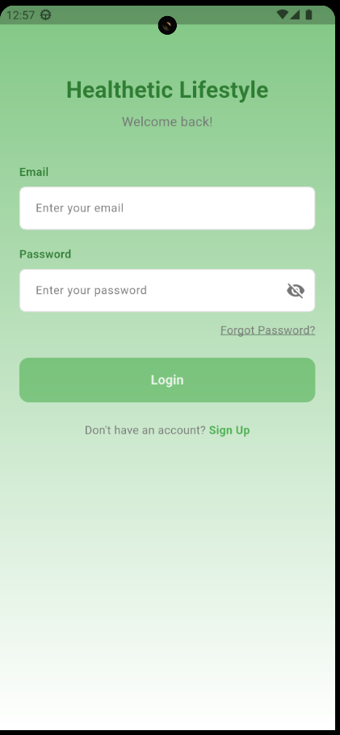
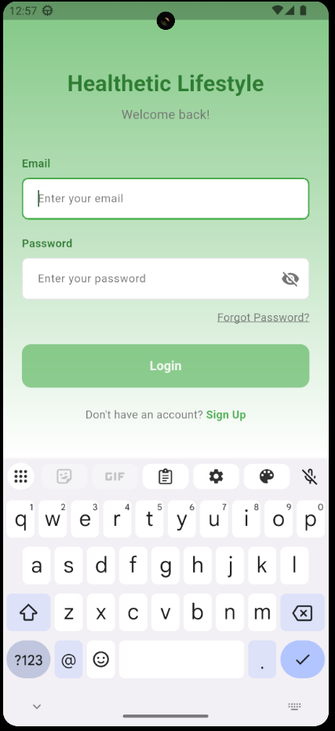
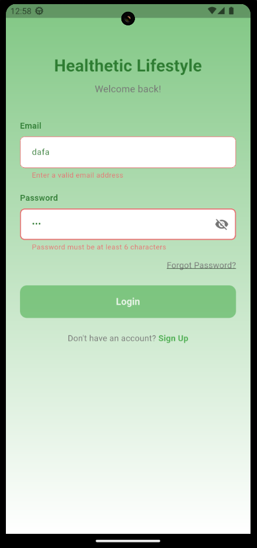
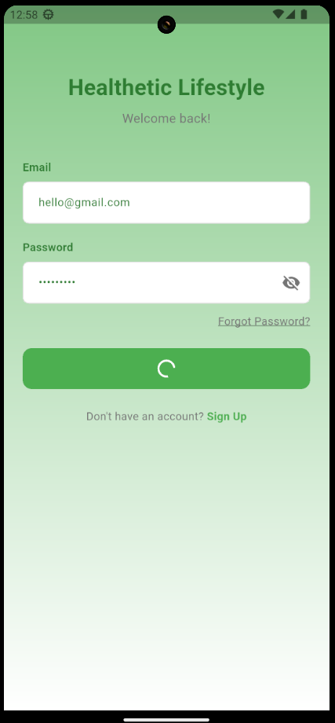
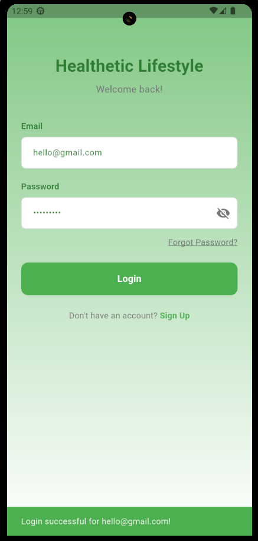

# Healthetic — Flutter Login Screen

A polished login screen built with Flutter for the Healthetic Lifestyle app. This project demonstrates clean UI implementation with form validation, animations, and responsive design — all using vanilla Flutter (no third-party packages).

---

## Screenshots

Idle State



Focused Field



Validation Errors



Loading Spinner



Login Message



---

## Features

- **Splash Screen** — displays brand name for 2 seconds, then navigates to login
- **Email & Password Validation** — real-time validation with regex for email and minimum length for password
- **Password Visibility Toggle** — eye icon to show/hide password
- **Loading State** — spinner replaces button text during simulated login
- **Animations** — fade-in on screen load, scale animation on button press
- **Gradient Background** — green-to-white gradient matching brand colors
- **Disabled Button** — login button stays inactive until both fields are valid

## Project Structure

```
lib/
├── main.dart                    # app entry point, portrait lock
├── constants/
│   └── colors.dart              # brand color palette
├── screens/
│   ├── splash_screen.dart       # splash with auto-navigation
│   └── login_screen.dart        # login form with validation
└── widgets/
    ├── custom_text_field.dart    # reusable input field widget
    └── branded_button.dart      # button with loading + scale animation
```

## Color Palette

| Color            | Hex       |
|------------------|-----------|
| Primary Green    | `#4CAF50` |
| Secondary Green  | `#81C784` |
| Dark Green       | `#2E7D32` |
| Neutral White    | `#FFFFFF` |
| Neutral Grey     | `#757575` |
| Light Grey       | `#E0E0E0` |
| Error Red        | `#E57373` |

## Prerequisites

- Flutter SDK `>=3.9.2`
- Dart SDK (comes with Flutter)
- Android emulator or iOS simulator

## Getting Started

```bash
git clone <repo-url>
cd healthetic
flutter pub get
flutter run
```

## Design Decisions

- **Reusable widgets** — `CustomTextField` and `BrandedButton` are designed to be reused across the app, not just on the login screen
- **Real-time validation** — the login button enables/disables as you type instead of showing errors only on submit, which feels more responsive
- **No third-party packages** — everything is built with `flutter/material.dart` to keep dependencies minimal
- **Portrait lock** — the login UI is vertical-only, so orientation is locked to avoid layout issues

## Demo Video

Demo Video Link: https://drive.google.com/file/d/1oVjcaqbAAwgbpEIlL9laqzSm9zk9vwTp/view?usp=sharing

---

Built with Flutter 💚